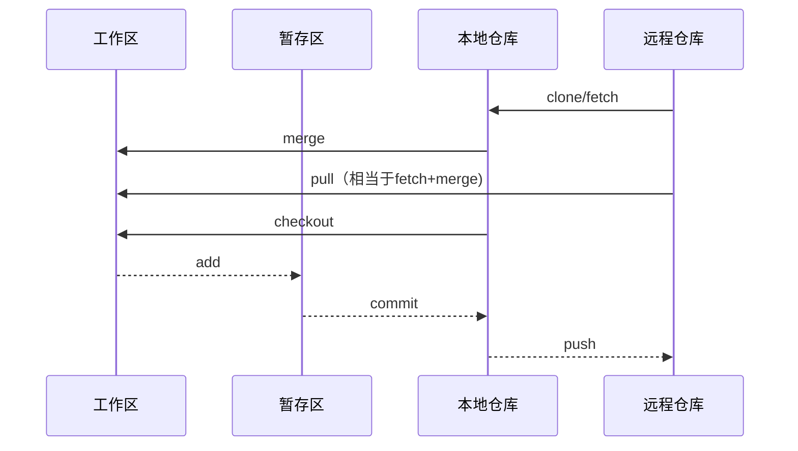
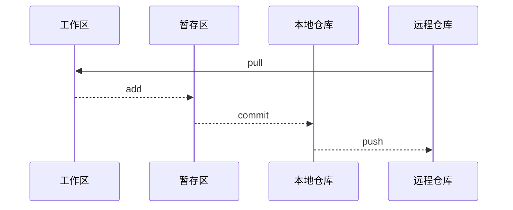

# Git 中的基本概念和常用命令

## 基本概念

有几个关键概念，理解之后，对于使用 Git 有很大帮助。

### 仓库

所谓仓库，就是带有Git工具所需信息的文件夹（删除其中的`.Git`隐藏目录后，该目录也就变成了普通目录）。所有的 Git 操作，使用命令行工具时，需要进入到仓库（也就是目录中）才可以正确执行。

### 本地电脑中的三个区域

Git 是分布式版本控制系统，本地电脑就是一个完整的版本控制系统，由工作区、暂存区、本地仓库三个区域组成，所谓区域都是逻辑上的划分，并不会文件系统中可见。

#### 工作区

工作区就和正常的目录是一致的，我们可以在里面创建文件和文件夹，进行存放、删除、修改等操作。

### 暂存区

暂存区存放修改过的、打算存放到本地仓库的、让版本控制系统记录的各种文件，为什么不直接将修改后的文件存放到本地仓库呢？因为有些修改、有些文件可能不值得、或者不应该存放到本地仓库。暂存区给了用户更多的灵活性。

### 本地仓库

存放经过确认之后的文件详细信息。本地仓库保留有完整的修改历史，在内容上和远程仓库是一致的。

### 远程服务器

远程服务器的作用，主要是在网络中存放数据，以便和他人共享。远程服务器中通常只有远程仓库。

## 常用 Git 命令

|     命令     |                             功能                              |
| ------------ | ------------------------------------------------------------- |
| git init     | 初始化 Git 仓库                                               |
| git clone    | 下载远程仓库到本地（包含所有历史信息                          |
| git pull     | 取回远程仓库的变化，并与本地分支合并（相当于 fetch + merge ） |
| git add      | 添加本地文件到暂存区                                          |
| git commit   | 确认变化信息，提交到本地仓库                                  |
| git push     | 推送代码到远程库                                              |
| git diff     | 显示暂存区和工作区的差异                                      |
| git checkout | 切换到指定分支                                                |
| git fetch    | 下载远程仓库所有变动到本地                                    |
| git merge    | 合并指定分支到当前分支                                        |

## Git 常用工作流程

### 常用流程



## 简化流程

对于简单的个人项目，只需四个常用操作即可：



## 仓库连接协议

Git 支持多种仓库的连接协议，其各自的优缺点如下：

### 本地协议：相关于硬盘内的另一个目录

```bash
git clone file:///srv/git/project.git
```

优点：基于文件系统的版本库的优点是简单，并且直接使用了现有的文件权限和网络访问权限。

缺点：通常共享文件系统比较难配置，并且比起基本的网络连接访问，这不方便从多个位置访问。

### HTTP协议：通过 HTTP 通信

```bash
git clone https://example.com/gitproject.git
```

优点：不同的访问方式只需要一个 URL 以及服务器只在需要授权时提示输入授权信息，这两个简便性让终端用户使用 Git 变得非常简单。

缺点：在一些服务器上，架设 HTTP/S 协议的服务端会比 SSH 协议的棘手一些。不做设置时，每次都需要输入用户名和密码信息才能完成推送操作。

### SSH协议：使用SSH 协议作为传输协议

```bash
git clone ssh://[user@]server/project.git
```

优点：SSH 架设相对简单 —— SSH 守护进程很常见，多数管理员都有使用经验，并且多数操作系统都包含了它及相关的管理工具。 其次，通过 SSH 访问是安全的 —— 所有传输数据都要经过授权和加密。 最后，与 HTTP/S 协议、Git 协议及本地协议一样，SSH 协议很高效，在传输前也会尽量压缩数据。

缺点：不能匿名访问。

### Git协议

```bash
git clone git@gitee.com:newmedia-course/fe-2017-news.git
```

Git 协议包含在 Git 里的一个特殊的守护进程；它监听在一个特定的端口（9418），类似于 SSH 服务，但是访问无需任何授权。

优点：Git 协议是 Git 使用的网络传输协议里最快的。

缺点：Git 协议缺点是缺乏授权机制。
